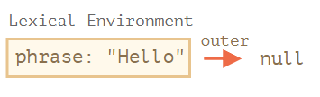
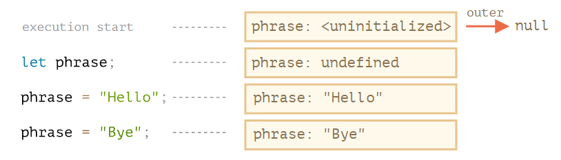
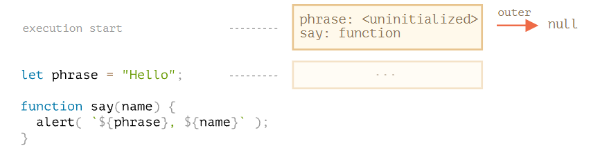
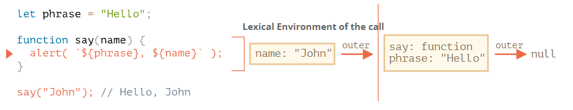
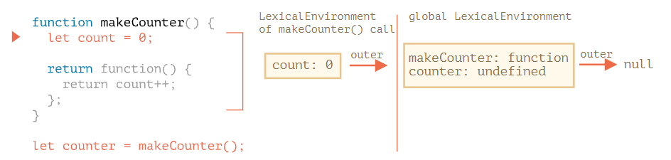
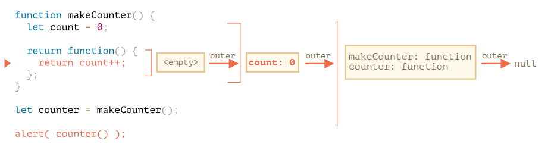
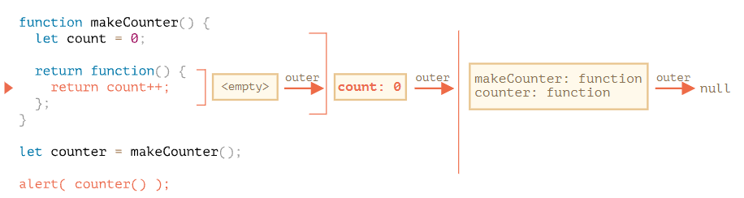
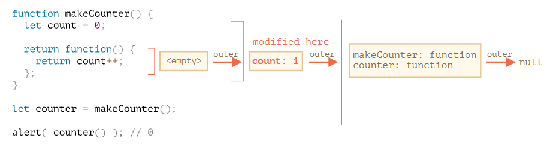

# 6.1 재귀와 스택

재귀는 **큰 목표 작업 하나를 동일하면서 간단한 작업 여러 개로 나눌 수 있을 때** 유용한 프로그래밍 패턴이다. **목표 작업을 간단한 동작 하나와 목표 작업을 변형한 작업으로 단순화시킬 수 있을 때**도 재귀를 사용할 수 있다. **특정 자료구조를 다뤄야 할 때**도 재귀가 사용된다.

재귀란 어떤 함수가 자기 자신을 호출하는 것을 말한다.

## 두 가지 사고방식

```jsx
// 1. 반복적인 사고를 통한 방법
function pow(x, n) {
  let result = 1;

  // 반복문을 돌면서 x를 n번 곱함
  for (let i = 0; i < n; i++) {
    result *= x;
  }

  return result;
}

alert( pow(2, 3) ); // 8

// 2. 재귀적인 사고를 통한 방법
function pow(x, n) {
  if (n == 1) {
    return x;
  } else {
    return x * pow(x, n - 1);
  }
}

alert( pow(2, 3) ); // 8
```

자바스크립트 엔진은 최대 재귀 깊이를 제한한다. (만 ~ 십만) 

## 실행 컨텍스트와 스택

실제 재귀 호출이 어떻게 동작하는지 알아보기 위해 함수의 내부 동작에 대해서도 살펴봐야 한다.

실행 중인 함수의 실행 절차에 대한 정보는 해당 함수의 실행 컨텍스트에 저장된다. **실행 컨텍스트**는 함수 실행에 대한 세부 정보를 담고 있는 내부 데이터 구조다. 제어 흐름의 현재 위치, 변수의 현재 값, `this`의 값 등이 실행 컨텍스트에 저장된다. 함수 호출 한 번당 정확히 하나의 실행 컨텍스트가 생성된다. 

함수 내부에 중첩 호출이 있을 때는 아래와 같은 절차가 진행된다.

- 현재 함수의 실행이 일시 중지된다.
- 중지된 함수와 연관된 실행 컨텍스트는 실행 컨텍스트 스택이라는 특별한 자료구조에 저장된다.
- 중첩 호출이 실행된다.
- 중첩 호출 실행이 끝난 후 실행 컨텍스트 스택에서 일시 중단한 함수의 실행 컨텍스트를 꺼내오고, 중단한 함수의 실행을 다시 이어간다.

재귀 깊이는 스택에 들어가는 실행 컨텍스트 수의 최댓값과 같다. 실행 컨텍스트는 메모리를 차지하므로 재귀를 사용할 땐 메모리 요구사항에 유의해야 한다. 한편, **반복문 기반 알고리즘을 사용하면 메모리가 절약된다. 재귀를 사용하면 코드가 짧아지고 유지보수에 이점이 있다.**

### 과제

- 주어진 숫자까지의 모든 숫자 더하기

```jsx
// 1. for 반복문 사용하기
function sumTo(n) {
	let result = 0;
	for (let i = 1; i <= n; i++) {
		result += i;
	}

	return result;
}

// 2. 재귀
function sumTo(n) {
	if (n === 1) return 1;
	
	return n + sumTo(n - 1);
}

// 3. 등차수열
function sumTo(n) {
	return n(n - 1) / 2;
}

// 더 생각해보기 1: 세 가지 방법 중 어떤 방법이 가장 빠른가요? 어떤 방법이 가장 느린가요? 이유도 함께 제시해주세요.

// 더 생각해보기 2: 재귀를 사용해 sumTo (100000)를 계산할 수 있을까요?
```

# 6.2 나머지 매개변수와 전개 문법

## 나머지 매개변수 `...`

나머지 매개변수는 남아있는 인수를 모으는 역할을 하므로 항상 마지막에 있어야 한다.

## 'arguments' 변수

`arguments`라는 특별한 유사 배열 객체를 이용하면 인덱스를 사용해 모든 인수에 접근할 수 있다.

나머지 매개변수 문법이 등장하기 전에 사용했던 듯하다. `arguments`는 유사 배열 객체면서 이터러블이다. 즉 배열은 아니다. 그래서 배열 메서드를 사용할 수 없다. 레거시를 만날 때가 아니라면 굳이 익히지 않아도 될 듯하다.

## spread 문법

# 6.3 변수의 유효범위와 클로저

## 코드 블록

코드 블록 `{...}` 안에서 선언한 변수는 블록 안에서만 사용할 수 있다.

## 중첩 함수

함수 내부에서 선언한 함수는 중첩 함수라 부른다. 중첩 함수는 새로운 객체의 프로퍼티 형태나 중첩 함수 그 자체로 반환될 수 있다. 이렇게 반환된 중첩 함수는 어디서든 호출해 사용할 수 있다. 외부 변수에 접근할 수 있는 것도 변함없다.

```jsx
function makeCounter() {
  let count = 0;

  return function() {
    return count++;
  };
}

let counter = makeCounter();

alert( counter() ); // 0
alert( counter() ); // 1
alert( counter() ); // 2
```

그런데 `makeCounter`를 살펴보면 `counter`를 여러 개 만들어도 이 함수들이 독립적일지, 함수와 중첩 함수 안의 `count` 변수엔 어떤 값이 할당될지 등의 의문이 생긴다.

## 렉시컬 환경

실행중인 함수, 코드 블록, 스크립트 전체는 렉시컬 환경이라 불리는 내부 숨김 연관 객체를 갖는다.

렉시컬 환경은 명세서에서 자바스크립트가 어떻게 동작하는지 설명하는 데 쓰이는 이론 상의 객체다. 따라서 코드를 사용해 직접 렉시컬 환경을 얻거나 조작하는 것은 불가능하다.

랙시컬 환경 객체는 두 부분으로 구성된다. 

- 환경 레코드 - 모든 지역 변수를 프로퍼티로 저장하고 있는 객체, `this` 값과 같은 기타 정보 포함.
- 외부 렉시컬 환경에 대한 참조 - 외부 코드와 연관

### 변수

**변수**는 특수 내부 객체인 **환경 레코드의 프로퍼티**일 뿐이다. 변수를 가져오거나 변경하는 것은 환경 레코드의 프로퍼티를 가져오거나 변경함을 의미한다.

```jsx
let phrase = 'Hello';
alert(phrase);
```

위 두 줄의 코드엔 렉시컬 환경이 하나만 존재한다.

이렇게 스크립트 전체와 관련된 렉시컬 환경은 전역 렉시컬 환경이라고 한다. 변수가 저장되는 환경 레코드엔 `phrase: 'Hello';`가 있고 전역 렉시컬 환경은 외부 참조를 갖지 않기 때문에 `null`을 가리킨다.



코드가 실행되고 실행 흐름이 이어져 나가면서 렉시컬 환경은 변화한다.

```jsx
// (1)
let phrase; // (2)
phrase = 'Hello'; // (3)
phrase = 'Bye'; // (4)
```

1. 스크립트가 시작되면 스크립트 내에서 선언한 변수 전체가 렉시컬 환경에 올라간다. 이때 변수의 상태는 특수 내부 상태인 'uninitialized'가 된다. 자바스크립트 엔진은 uninitialized 상태의 변수를 인지하긴 하지만 `let`을 만나기 전까진 이 변수를 참조할 수 없다.
2. `let phrase`가 나타났다. 갑을 할당하기 전이기 때문에 프로퍼티 값은 `undefined`, 이 시점부터 `phrase`를 사용할 수 있다.
3. `phrase` 값이 할당되었다.
4. `phrase` 값이 변경되었다.



### 함수 선언문

함수는 변수와 마찬가지로 값이다. 다만 함수 선언문으로 선언한 함순느 일반 변수와는 달리 바로 초기화된다. 함수 선언문으로 선언한 함수는 렉시컬 환경이 만들어지는 즉시 사용할 수 있다. (변수가 `let`을 만나 선언될 때까지 사용할 수 없는 것과 달리) 선언되기 전에도 함수를 사용할 수 없는 이 때문이다. 함수 표현식은 해당하지 않는다. (e.g., `let say = function(name) ...`) 



### 내부와 외부 렉시컬 환경

함수를 호출해 실행하면 새로운 렉시컬 환경이 자동으로 만들어진다. 이 렉시컬 환경엔 함수 호출 시 넘겨받은 매개변수와 함수의 지역 변수가 저장된다. `say('John')`을 호출하면 아래와 같은 내부 변화가 일어난다. (중간에 빨간 줄에 멈춰있는 상황이다.)



함수 호출 중에 호출하고 있는 함수를 위한 내부 렉시컬 환경과 그것이 가리키는 외부 렉시컬 환경을 갖게 된다.

- 예시의 **내부 렉시컬 환경**은 현재 실행 중인 함수 `say`에 상응한다. 내부 렉시컬 환경엔 함수의 인자인 `name`으로부터 유래한 프로퍼티 하나가 있다. `say('John')`을 호출했기 때문에 `name`의 값은 `'John'`이다.
- 예시의 **외부 렉시컬 환경**은 전역 렉시컬 환경이다. `phrase`와 함수 `say`를 프로퍼티로 갖는다.

내부 렉시컬 환경은 외부 렉시컬 환경에 대한 참조를 갖는다.

코드 변수에서 접근할 땐, 먼저 내부 렉시컬 환경을 검색 범위로 잡는다. **내부 렉시컬 환경에서 원하는 변수를 찾지 못하면 검색 범위를 내부 렉시컬 환경이 참조하는 외부 렉시컬 환경으로 확장한다.** 이 과정은 검색 범위가 전역 렉시컬 환경으로 확장될 때까지 반복된다.

전역 렉시컬 환경 도달할 때까지 변수를 찾지 못하면 엄격 모드에서는 에러가 발생한다. 비 엄격 모드에선 정의되지 않은 변수에 값을 할당하려고 하면 에러 대신 새로운 전역 변수가 만들어진다. 

다시 변수 검색이 어떻게 진행되는지 정리하면,

- 함수 `say` 내부의 `alert`에서 변수 `name`에 접근할 땐, 먼저 내부 렉시컬 환경을 살펴본다. 내부 렉시컬 환경에서 변수 `name`을 찾는다.
- `alert`에서 변수 `phrase`에 접근하려는데, `phrase`에 상응하는 프로퍼티가 내부 렉시컬 환경엔 없다. 따라서 검색 범위는 외부 렉시컬 환경으로 확장된다. 외부 렉시컬 환경에서 `phrase`를 찾는다.

### 함수를 반환하는 함수

다시 원래 상황으로 돌아와서,

> 그런데 `makeCounter`를 살펴보면 `counter`를 여러 개 만들어도 이 함수들이 독립적일지, 함수와 중첩 함수 안의 `count` 변수엔 어떤 값이 할당될지 등의 의문이 생긴다.
> 

```jsx
function makeCounter() {
  let count = 0;

  return function() {
    return count++;
  };
}

let counter = makeCounter();
```

`makeCounter()`를 호출하면 호출할 때마다 새로운 렉시컬 환경 객체가 만들어지고 여기에 `makeCounter`를 실행하는데 필요한 변수들이 저장된다. `makeCounter()`를 호출할 때도 두 개의 렉시컬 환경이 만들어진다.



하지만 위 예시와 달리 이 상황에서는 `makeCounter()`가 실행되는 도중에 `return count++`를 담은 중첩 함수가 만들어진다. 아직 중첩함수가 생성되기만 하고 실행되기 전 상태다.

여기서 중요한 것은, 모든 함수는 함수가 생성된 곳의 렉시컬 환경은 기억하는 점이다. 함수는 `[[Environment]]`라 불리는 숨김 프로퍼티를 갖는데, 여기에 함수가 만들어진 곳의 렉시컬 환경에 대한 참조가 저장된다.



따라서 `counter.[[Environment]]`엔 `{count: 0}`이 있는 렉시컬 환경에 대한 참조가 저장된다. 호출 장소와 상관없이 함수가 자신이 태어난 곳을 기억할 수 있는 건 바로 이 `[[Environment]]` 프로퍼티 덕분이다. 이 프로퍼티는 함수가 생성될 때 딱 한 번 값이 설정되고 영원히 변하지 않는다.

`counter()`를 호출하면 각 호출마다 새로운 렉시컬 환경이 생성된다. 그리고 이 렉시컬 환경은 `counter.[[Environment]]`에 저장된 렉시컬 환경을 외부 렉시컬 환경으로서 참조한다.



실행 흐름이 중첩 함수의 본문으로 넘어오면 `count` 변수가 필요한데, 먼저 자체 렉시컬 환경에서 변수를 찾는다. 익명 중첩 함수엔 지역 변수가 없기 때문에 이 렉시컬 환경은 비어있다. (`<empty>`) 이제 `counter()`의 렉시컬 환경이 참조하는 외부 렉시컬 환경에서 `count`를 찾는다. 찾았다. 이제 `count++`가 실행되는데, 변수값 갱신은 변수가 저장된 렉시컬 환경에서 이뤄진다. 따라서 실행이 종료된 후의 상태는 다음과 같다.



`counter()`를 여러 번 호출하면 `count` 변수가 계속해서 증가하는 이유가 이 때문이다.

### 클로저

클로저는 외부 변수를 기억하고 이 외부 변수에 접근할 수 있는 함수를 의미한다. 자바스크립트에선 모든 함수가 자연스럽게 클로저가 된다. (예외도 있다.)

정리하건대, 자바스크립트의 함수는 숨김 프로퍼티인 `[[Environment]]`를 이용해 자신이 어디서 만들어졌는지를 기억한다. 함수 본문에선 `[[Environment]]`를 사용해 외부 변수에 접근한다.

인터뷰에서 **"클로저가 무엇입니까?"**라는 질문을 받으면, **클로저의 정의**를 말하고 **자바스크립트에서 왜 모든 함수가 클로저인지**에 관해 설명하면 된다. 이때 `**[[Environment]]` 프로퍼티와 렉시컬 환경이 어떤 방식으로 동작하는지**에 대한 설명을 덧붙이면 좋다.

## 가비지 컬렉션

함수 호출이 끝나면 함수에 대응하는 렉시컬 환경이 메모리에서 제거된다. 함수와 관련된 변수들은 이때 모두 사라진다. 함수 호출이 끝나면 관련 변수를 참조할 수 없는 이유다. 

그런데 호출이 끝난 후에도 여전히 도달 가능한 중첩 함수가 있을 수 있다. 이때는 이 중첩 함수의 `[[Environment]]` 프로퍼티 외부 함수 렉시컬 환경에 대한 정보가 저장된다. 즉 도달 가능한 상태가 되는 것이다. 함수 호출이 끝나도 렉시컬 환경이 메모리에 유지되는 이유는 이 때문이다.

e.g.,

```jsx
function f() {
  let value = 123;

  return function() {
    alert(value);
  }
}

let g = f(); 
// g.[[Environment]]에 f() 호출 시 만들어지는 렉시컬 환경 정보가 저장된다.
```

그런데 이렇게 중첩 함수를 사용할 땐 주의할 점이 있다. `f()`를 여러 번 호출하고 그 결과를 어딘가에 저장하는 경우, 호출 시 만들어지는 각 렉시컬 환경 모두가 메모리에 유지된다는 점이다. 

```jsx
function f() {
  let value = Math.random();

  return function() { alert(value); };
}

// 배열 안의 세 함수는 각각 f()를 호출할 때 생성된 렉시컬 환경과 연관 관계를 맺는다.
let arr = [f(), f(), f()];
```

렉시컬 환경 객체는 다른 객체와 마찬가지로 도달할 수 있다면 메모리에서 삭제되지 않는다. 해당 렉시컬 환경 객체를 참조하는 중첩 함수가 하나라도 있으면 사라지지 않는다.

```jsx
function f() {
  let value = 123;

  return function() {
    alert(value);
  }
}

let g = f(); // g가 살아있는 동안엔 연관 렉시컬 환경도 메모리에 살아있다.

g = null; // 도달할 수 없는 상태가 되었으므로 메모리에서 삭제된다.
```

이렇게 중첩 함수가 메모리에서 삭제되고 난 후에야, 이를 감싸는 렉시컬 환경(그리고 그 안의 변수인 `value`)도 메모리에서 제거된다.

### 최적화 프로세스

앞에서 보았듯, 함수가 살아있는 동안엔 이론상 모든 외부 변수 역시 메모리에 유지된다. 그러나 실제로는 자바스크립트 엔진이 이를 지속해서 최적화한다. 자바스크립트 엔진은 변수 사용을 분석하고 외부 변수가 사용되지 않는다고 판단되면 이를 메모리에서 제거한다.

디버깅 시, 최적화 과정에서 제거된 변수를 사용할 수 없다는 점은 V8 엔진의 주요 부작용이다. 

```jsx
function f() {
  let value = Math.random();

  function g() {
    debugger;
		// 실행이 일시 중지되었을 때 콘솔에 alert(value)를 입력하면, 에러 발생
		// Uncaught ReferenceError: value is not defined
  }

  return g;
}

let g = f();
g();
```

이론상으론 `value`에 접근할 수 있어야 하지만 최적화 대상이 되어 이런 에러가 발생한다. 이런 외부 변수 최적화는 디버깅 이슈를 발생시키곤 한다.

## 과제

### 함수가 최근 변수 갱신을 반영할까?

```jsx
let name = "John";

function sayHi() {
  alert("Hi, " + name);
}

name = "Pete";

sayHi(); // what will it show: "John" or "Pete"?
```

A. `Pete`, 함수 호이스팅 때문.

### if 문 안의 함수

실행 결과 예측해보기

```jsx
let phrase = "Hello";

if (true) {
  let user = "John";

  function sayHi() {
    alert(`${phrase}, ${user}`);
  }
}

sayHi();
```

A. 에러 발생

`sayHi`는 `if`문의 최상단으로 호이스팅된다. 그렇다고 해도 `if` 바깥은 아니기 때문에 바깥에선 접근할 수 없다.

### 클로저를 이용하여 합 구하기

`sum(a)(b) = a + b`와 같은 연산을 해주는 함수 만들기.

A.

```jsx
function sum(a) {
	return function (b) {
		return a + b;
	}
}
// 두 번째 괄호가 제대로 동작하려면 첫 번째 괄호는 반드시 함수를 반환해야 한다.
```

### 변수가 보일까?

실행 결과 예측해보기

```jsx
let x = 1;

function func() {
  console.log(x); // ?

  let x = 2;
}

func();
```

A.  에러 발생

`x`는 `let`이 나오기 전까진 uninitialized 상태를 유지한다. 따라서 `console.log(x)`를 하는 시점에선 참조할 수 없다. 이 일시적인 영역을 데드 존(dead zone)이라고 부른다.

### 함수를 이용해 원하는 값만 걸러내기

`filter`에 넘겨서 사용할 수 있는 함수 두 가지를 만들어보기.

- `inBetween(a, b)` – `a` 이상 `b` 이하
- `inArray([...])` – 배열 안에 있는 값인가

A. 

```jsx
function inBetween(from, to) {
	return function(x) {
		return x >= from && x <= to;
	};
}

function inArray(numbers) {
	return function(x) {
		return numbers.includes(x);
	}
}

let arr = [1, 2, 3, 4, 5, 6, 7];

alert( arr.filter(inBetween(3, 6)) ); // 3,4,5,6

alert( arr.filter(inArray([1, 2, 10])) ); // 1,2
```

### 함수를 사용해 군대 만들기

아래 코드는 `shooters`가 요소인 배열을 만들어준다. 모든 함수는 몇 번째 shooters인지 출력해줘야 하는데 뭔가 잘못됐다. 

```jsx
function makeArmy() {
  let shooters = [];

  let i = 0;
  while (i < 10) {
    let shooter = function() { // shooter 함수
      alert( i ); // 몇 번째 shooter인지 출력해줘야 함
    };
    shooters.push(shooter);
    i++;
  }

  return shooters;
}

let army = makeArmy();

army[0](); // 0번째 shooter가 10을 출력함
army[5](); // 5번째 shooter 역시 10을 출력함
// 모든 shooter가 자신의 번호 대신 10을 출력하고 있음
```

왜 모든 shooter가 동일한 숫자를 출력할까? 제대로 출력하도록 수정해보기.

A.

함수 `shooter`안에 지역 변수 `i`가 없기 때문이다. 함수가 호출될 때 바깥 렉시컬 환경으로부터 `i`를 가져오게 된다. (그 `i`는 `while`문을 돌며 마지막에 10으로 갱신된 값이다.)

```jsx
function makeArmy() {
  let shooters = [];

  for(let i = 0; i < 10; i++) {
    function shooter() { 
      console.log(i);
    };
    
    shooters.push(shooter);
  }

  return shooters;
}

let army = makeArmy();

army[0](); 
army[5]();
```

`for`문으로 수정하면 각각 블록 렉시컬 환경이 생성된다.

 새로운 변수에 값을 할당해서 해결하는 방벋오 있다.

```jsx
function makeArmy() {
  let shooters = [];

  let i = 0;
  while (i < 10) {
    let j = i;
    let shooter = function() { // shooter function
      alert( j ); // should show its number
    };
    shooters.push(shooter);
    i++;
  }

  return shooters;
}

let army = makeArmy();

army[0](); // 0
army[5](); // 5
```

# 6.4 오래된 'var'

## 블록 스코프가 없다.

`var`로 선언한 변수의 스코프는 함수 스코프이거나 전역 스코프다. 블록 기준으로 스코프가 생기지 않기 때문에 블록 밖에서 접근 가능하다.

## 재선언을 허용한다.

## 선언하기 전에도 사용할 수 있다.

`var`로 선언한 변수는 함수의 최상의로 끌어 올려진다. (hoisted) 이러한 현상을 호이스팅이라 한다. 선언은 호이스팅되지만 할당은 호이스팅되지 않는다.

## 즉시 실행 함수 표현식

즉기 실행 함수 표현식(IIFE)을 이용하면 `var`도 블록 레벨 스코프를 가질 수 있다.

# 6.5 전역 객체

전역 객체를 사용하면 어디서나 사용 가능한 변수나 함수를 만들 수 있다. 전역 객체는 언어 자체나 호스트 환경에 기본 내장되어 있는 경우가 많다. 브라우저 환경에선 전역 객체를 `windows`, Node.js 환경에선 `global`이라고 부르는데, 각 호스트 환경마다 부르는 이름은 다르다.

전역 객체 이름을 `globalThis`로 표준화하자는 내용이 최근에 자바스크립트 명세에 추가됐다. 크로미움 기반이 아닌 몇몇 브라우저는 아직  `globalThis`를 지원하진 않지만 이에 대한 폴리필을 쉽게 만들 수 있다. (일단 여기서는 `window`로 정리)

전역 객체의 모든 프로퍼티는 직접 접근할 수 있다.

```jsx
alert("Hello");
// 위와 동일하게 동작한다.
window.alert("Hello");
```

`var` 대신 `let`을 사용하면 전역 객체를 통해 변수에 접근할 수 없다.

```jsx
var gVar = 5;

alert(window.gVar); // 5, var로 선언한 변수는 전역 객체 window의 프로퍼티가 된다.
alert(window.gLet); // undefined, 전역 객체의 프로퍼티가 되지 않는다.

// 중요한 변수라서 모든 곳에서 사용할 수 있게 하려면, 직접 프로퍼티를 추가해주어야 한다.
window.currentUser = {
  name: "John"
};
// 물론 되도록 사용하지 않는 것이 좋다. 
```

# 6.6 객체로서의 함수와 기명 함수 표현식