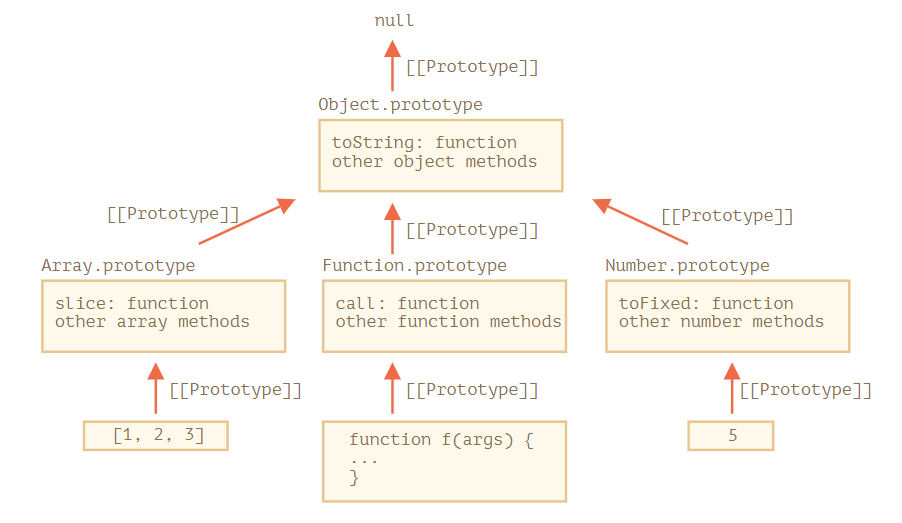

# 8.1 프로토타입 상속

개발을 하다 보면 기존에 있는 가져와 확장해야 하는 경우가 생긴다.

사람에 관한 프로퍼티와 메서드를 가진 `user`라는 객체가 있는데, `user`와 상당히 유사하지만 약간의 차이가 있는 `admin`과 `guest` 객체를 만들어야 한다고 해보자. 이때 `user`의 메서드를 복사하거나 다시 구현하지 않고 약간의 기능을 얹어 `admin`과 `guest` 객체를 만들 수 있지 않을까 하는 생각이 든다.

자바스크립트의 고유 기능인 프로토타입 상속을 이용하면 이를 실현할 수 있다.

## [[Prototype]]

자바스크립트의 객체는 `[[Prototype]]`이라는 숨김 프로퍼티를 갖는다. 이 숨김 프로퍼티 값은 `null`이거나 다른 객체에 대한 참조가 되는데, 다른 객체를 참조하는 경우 참조 대상을 프로토타입이라 부른다.

프로토타입은 꽤나 특이하게 동작한다. `object`에서 프로퍼티를 읽으려고 하는데 해당 프로퍼티가 없으면 자바스크립트는 자동으로 프로토타입에서 프로퍼티를 찾는다. 프로그래밍에선 이런 동작 방식을 프로토타입 상속이라 한다. 

`[[Prototype]]` 프로퍼티는 내부 프로퍼티면서 숨김 프로퍼티지만 다양한 방법을 사용하여 개발자가 값을 설정할 수 있다.

e.g.,

```jsx
let animal = {
  eats: true
};

let rabbit = {
  jumps: true
};

rabbit.__proto__ = animal;
```

`**__proto__`는 `[[Prototype]]`의 getter이자 setter다.**

하위 호환성 때문에 여전히 `__proto__`를 사용할 순 있지만 최근엔 그 대신 `Object.getPrototypeOf`나 `Objet.setPrototypeOf`를 써서 프로토타입을 획득하거나 설정한다. 

객체 `rabbit`에서 프로퍼티를 얻고 싶은데 해당 프로퍼티가 없다면, 자바스크립트는 자동으로 `animal`이라는 객체에서 프로퍼티를 얻는다.

```jsx
let animal = {
  eats: true
};

let rabbit = {
  jumps: true
};

rabbit.__proto__ = animal; // animal이 rabbit의 프로토타입이 되도록 설정했다.

// 프로퍼티 eats를 rabbit에서도 사용할 수 있게 되었다.
alert( rabbit.eats ); // true, rabbit에 없어서 프로토타입인 animal로 부터 얻었다.
alert( rabbit.jumps ); // true
```

프로토타입 체인은 훨씬 길어질 수도 있다.

```jsx
let animal = {
  eats: true,
  walk() {
    alert("동물이 걷습니다.");
  }
};

let rabbit = {
  jumps: true,
  __proto__: animal
};

let longEar = {
  earLength: 10,
  __proto__: rabbit
};

// 메서드 walk는 프로토타입 체인을 통해 상속받았습니다.
longEar.walk(); // 동물이 걷습니다.
alert(longEar.jumps); // true (rabbit에서 상속받음)
```

프로토타입 체이닝엔 제약사항이 있다.

- 순환 참조는 허용되지 않는다. `__proto__`를 이용해 닫힌 형태로 다른 객체를 참조하면 에러가 발생한다.
- `__proto__`의 값은 객체나 `null`만 가능하다.
- 당연히 객체엔 오직 하나의 `[[Prototype]]`만 있을 수 있다. 객체는 두 개의 객체를 상속받지 못한다.

## 쓸 때는 프로토타입을 사용하지 않는다.

프로토타입은 프로퍼티를 읽을 때만 사용한다. 프로퍼티를 추가, 수정, 삭제하는 연산은 객체에 직접해야 한다.

```jsx
let animal = {
  eats: true,
  walk() {
    /* rabbit은 이제 이 메서드를 사용하지 않습니다. */
  }
};

let rabbit = {
  __proto__: animal
};

rabbit.walk = function() {
  alert("토끼가 깡충깡충 뜁니다.");
};

rabbit.walk(); // 토끼가 깡충깡충 뜁니다.
```

`rabbit.walk()`를 호출하면 프로토타입에 있는 메서드가 실행되지 않고, 객체 `rabbit`에 추가한 메서드가 실행된다. 그런데 접근자 프로퍼티는 setter 함수를 통해서 프로퍼티에 값을 할당하므로 이 규칙이 적용되지 않는다. 접근자 프로퍼티에 값을 할당하는 것은 함수를 호출하는 것과 같기 때문이다. 이를 이용하여 `admin.fullName`이 의도한대로 작동하게 할 수 있다.

```jsx
let user = {
  name: "John",
  surname: "Smith",

  set fullName(value) {
    [this.name, this.surname] = value.split(" ");
  },

  get fullName() {
    return `${this.name} ${this.surname}`;
  }
};

let admin = {
  __proto__: user,
  isAdmin: true
};

alert(admin.fullName); // John Smith (*)

// setter 함수가 실행됩니다!
admin.fullName = "Alice Cooper"; // (**)

alert(admin.fullName); // Alice Cooper , state of admin modified
alert(user.fullName); // John Smith , state of user protected
```

## this가 나타내는 것

`this`는 프로토타입에 영향을 받지 않는다. 매세드를 객체에서 호출했든 프로토타입에서 호출했든 상관없이 `this`는 상관없이 `.` 앞에 있는 객체가 된다.

`admin.fullName=` 으로 setter 함수를 호출할 때, `this`는 `user`가 아닌 `admin`이 된다. 객체 하나를 만들고 메서드를 많이 구현한 뒤, 여러 객체에서 이 커다란 객체를 상속받게 하는 경우가 많기 때문에 이러한 특징을 잘 알고 있어야 한다. 상속받은 메서드를 사용하더라도 객체는 프로토타입이 아닌 자신의 상태를 수정한다.

```jsx
// animal엔 다양한 메서드가 있다.
let animal = {
  walk() {
    if (!this.isSleeping) {
      alert(`동물이 걸어갑니다.`);
    }
  },

  sleep() {
    this.isSleeping = true;
  }
};

let rabbit = {
  name: "하얀 토끼",
  __proto__: animal
};

// rabbit의 프로퍼티 isSleeping을 true로 변경합니다.
rabbit.sleep();

alert(rabbit.isSleeping); // true
alert(animal.isSleeping); // undefined (프로토타입에는 isSleeping 프로퍼티가 없다.)
```

`rabbit` 말고도 `bird`, `snake` 등이 `animal`을 상속받는다고 해보자. 이 객체들도 `rabbit`처럼 `animal`에 구현된 메서드를 사용할 수 있다. 이때 상속받은 메서드의 `this`는 `animal`이 아닌 실제 메서드가 호출되는 시점의 점(`.`) 앞에 있는 객체가 된다. 따라서 `this`에 데이터를 쓰면 `animal`이 아닌 해당 객체의 상태가 변화한다. 즉 **메서드는 공유되지만, 객체의 상태는 공유되지 않는다.**

## for ... in 반복문

`for..in` 반복문은 상속 프로퍼티도 순회 대상에 포함시킨다.

```jsx
let animal = {
  eats: true
};

let rabbit = {
  jumps: true,
  __proto__: animal
};

// Object.keys는 객체 자신의 키만 반환합니다.
alert(Object.keys(rabbit)); // jumps

// for..in은 객체 자신의 키와 상속 프로퍼티의 키 모두를 순회합니다.
for(let prop in rabbit) alert(prop); // jumps, eats
```

`obj.hasOwnProperty(key)`를 이용하면 상속 프로퍼티를 순회 대상에서 제외할 수 있다. 이 내장 메서드는 `key`에 대응하는 프로퍼티가 상속 프로퍼티가 아니고, `obj`에 직접 구현되어있는 프로퍼티일 때 `true`를 반환한다.

**키-값을 순회하는 메서드 대부분은 상속 프로퍼티를 제외하고 동작한다.**

## 요약

- 자바스크립트의 모든 객체엔 숨김 프로퍼티 `[[Prototype]]`이 있는데, 이 프로퍼티는 객체나 `null`을 가리킨다.
- `obj.__proto__`를 사용하면 프로토타입에 접근할 수 있다. `__proto__`는 `[[Prototype]]`의 getter이자 setter로 쓰이는데, 요즘은 잘 쓰지 않는다.
- `[[Prototype]]`이 참조하는 객체를 프로토타입이라고 한다.
- `obj`에서 프로퍼티를 읽거나 메서드를 호출하려는데 해당하는 프로퍼티나 메서드가 없으면 자바스크립트는 프로토타입에서 프로퍼티나 메서드를 찾는다.
- 데이터 프로퍼티를 다루고 있다면, 쓰기나 지우기와 관련 연산은 프로토타입을 통하지 않고 객체에 직접 적용된다.
- 프로토타입에서 상속받은 메소드라도 `obj.method()`를 호출하면 메소드 안의 `this`는 호출 대상 객체인 `obj`를 가리킨다.
- `for..in` 반복문은 객체 자체에서 정의한 프로퍼티뿐만 아니라 상속 프로퍼티도순회 대상에 포함시킨다. 반면 키-값 관련된 내장 메서드 대부분은 상속 프로퍼티는 제외하고 객체 자체 프로퍼티만을 대상으로 동작한다.

# 8.2 함수의 prototype 프로퍼티

`new F()`와 같은 생성자 함수로 새로운 객체를 만들 수 있다. 그런데 `F.prototype`이 객체면 `new` 연산자는 `F.prototype`을 사용해 새롭게 생성된 객체의 `[[Prototype]]`을 설정한다.

자바스크립트가 만들어졌을 때는 프로토타입 기반 상속이 주요 기능 중 하나였다. 그런데 과거엔 프로토타입에 직접 접근할 방법이 없었다. 그나마 사용할수 있었던 방법이 생성자 함수의 `prototype` 프로퍼티를 이용하는 방법뿐이다. 많은 스크립트가 아직 이 방법을 사용하는 이유다.

`F.prototype`에서 `prototype`은 `F`에 정의된 일반 프로퍼티다. 앞서 배운 프로토타입 객체와 같아 보이지만 **이름만 같은 일반 프로퍼티다.**

```jsx
let animal = {
  eats: true
};

function Rabbit(name) {
  this.name = name;
}

Rabbit.prototype = animal;

let rabbit = new Rabbit("White Rabbit"); //  rabbit.__proto__ == animal

alert( rabbit.eats ); // true
```

`Rabbit.prototype = animal`은 `new Rabbit`을 호출해 만든 새로운 객체의 `[[Prototype]]`을 `animal`로 설정하라는 것을 의미한다.

**`F.prototype`은 `new F`를 호출할 때만 사용된다.**

`new F`를 호출해 새롭게 만든 객체의`[[Prototype]]`을 할당해준다. 새로운 객체가 만들어진 후에`F.prototype` 프로퍼티가 바뀌면(`F.prototype = <another object>`) `new F`로 만들어지는 새로운 객체는 또 다른 객체를 `[[Prototype]]`으로 갖게 된다. 다만, 기존에 있던 객체의 `[[Prototype]]`은 그대로 유지된다.

## 함수의 prototype 프로퍼티와 constructor 프로퍼티

따로 할당하지 않더라고 모든 함수는 `prototype` 프로퍼티를 간는다. 기본 프로퍼티인 `prototype`은 `constructor` 프로퍼티 하나만 있는 객체를 가리키는데, 이 `constructor` 프로퍼티는 함수 자신을 가리킨다. 특별한 조작을 가하지 않았다면 `Rabbit`을 구현한 객체 모두에서 `[[Prototype]]`을 거쳐 `constructor` 프로퍼티를 사용할 수 있다.

```jsx
function Rabbit() {}

// 기본 prototype:
// Rabbit.prototype = { constructor: Rabbit };

alert( Rabbit.prototype.constructor == Rabbit ); // true

let rabbit = new Rabbit(); // {constructor: Rabbit}을 상속받음

alert(rabbit.constructor == Rabbit); // true (프로토타입을 거쳐 접근)
```

`constructor` 프로퍼티를 사용하면 기존에 있던 객체의 `constructor`를 사용해 새로운 객체를 만들 수 있다. 

```jsx
function Rabbit(name) {
  this.name = name;
  alert(name);
}

let rabbit = new Rabbit("White Rabbit");
let rabbit2 = new rabbit.constructor("Black Rabbit");
```

어떤 객체를 만들 때 이 객체가 어떤 생성자가 사용되었는지 알 수 없는 경우, 이 방법을 유용하게 쓸 수 있다. 어느 방식을 사용해 객체를 만들든 `constructor`에서 가장 중요한 점은 다음과 같다.

**자바스크립트는 알맞은 `constructor` 값을 보장하지 않는다.**

함수에 기본으로 `prototype` 값이 설정되긴 하지만 그게 전부다. `constructor`에 벌어지는 모든 일은 전적으로 개발자에게 달려있다. 함수의 기본 `prototype` 값을 다른 객체로 바꾸면 이 객체엔 `constructor`가 없게 된다.

```jsx
function Rabbit() {}
Rabbit.prototype = {
  jumps: true
};

let rabbit = new Rabbit();
alert(rabbit.constructor === Rabbit); // false
```

이러한 상황을 방지하고 알맞은 `constructor`를 유지하려면 `prototype` 전체를 덮어쓰지 말고 기본 `prototype`에 원하는 프로퍼티를 추가, 제거해야 한다.

```jsx
function Rabbit() {}

// Rabbit.prototype 전체를 덮어쓰지 말고, 원하는 프로퍼티는 그냥 추가.
Rabbit.prototype.jumps = true
// 이렇게 하면 기본 Rabbit.prototype.constructor가 유지.
```

## 요약

- `F.prototype` 프로퍼티는 `[[Prototype]]`과는 다르다. `F.prototype`은 `new F()`을 호출할 때 만들어지는 새로운 객체의 `[[Prototype]]`을 설정한다.
- `F.prototype`의 값은 객체나 `null`만 가능하다.
- 이러한 내용은 생성자 함수에 `prototype`을 설정하고, 이 생성자 함수를 `new` 키워드를 통해 호출할 때만 적용된다. 일반 객체에 `prototype` 프로퍼티를 사용하면 아무런 일도 일어나지 않는다.
- 모든 함수는 기본적으로 `F.prototype = { constructor: F }`를 가지고 있으므로 함수의 `constructor` 프로퍼티를 사용하면 객체의 생성자를 얻을 수 있다.

# 8.3 네이티브 프로토타입

`prototype` 프로퍼티는 자바스크립트 내부에서 광범위하게 사용된다. 모든 내장 생성자 함수에서 `proptotype` 프로퍼티를 사용한다.

## Object.prototype

```jsx
let obj = {};
alert( obj ); // "[object Object]" ?
```

`[object Object]`라는 문자열은 어디서 나타난 걸까? 

리터럴 방식의 객체 선언 방식은 `let obj = new Object()`의 줄임말이다. 여기서 `Object`는 내장 객체 생성자 함수인데, 이 생성자 함수의 `prototype`은 `toString`을 비롯한 다양한 메서드가 구현되어있는 거대학 개체를 참조한다. 그래서 `obj.toString()`을 호출하면 `Object.prototype`에서 해당 메서드를 가져올 수 있게 되는 것이다.

## 다른 내장 프로토타입

`Array`, `Date`, `Function`을 비롯한 내장 객체들 역시 프로토타입에 메서드를 저장해놓는다.

명세서에선 모든 내장 프로토타입 꼭대기엔 `Object.prototype`이 있어야 한다고 규정한다. 이런 규정 때문에 "모든 것은 객체를 상속받는다"라는 말이 있다.

```jsx
let arr = [1, 2, 3];

// arr은 Array.prototype을 상속받았나요?
alert( arr.__proto__ === Array.prototype ); // true

// arr은 Object.prototype을 상속받았나요?
alert( arr.__proto__.__proto__ === Object.prototype ); // true

// 체인 맨 위엔 null이 있습니다.
alert( arr.__proto__.__proto__.__proto__ ); // null

alert(arr); // 1,2,3 <-- Array.prototype.toString 의 결과
// 체인 상의 프로토타입엔 중복 메서드가 있을 수 있다. 
// 이를테면, Array.prototype과 Object.prototype 둘 다 toString이 있다. 
// 이렇게 중복 메소드가 있을 때는 체인 상에서 가까운 곳에 있는 메서드가 사용된다.
```



크롬 개발자 콘솔과 같은 도구를 사용하면 상속 관계를 확인할 수 있다. `console.dir`을 사용하면 내장 객체의 상속 관계를 확인하는 데 도움이 된다.

## 원시값

문자열, 숫자, 불린 값은 객체가 아니다. 그런데 이런 원시값들의 프로퍼티에 접근하려고 하면 내장 생성자 `String`, `Number`, `Boolean`을 사용하는 임시 래퍼 객체가 생성된다. 이 객체들은 메서드를 제공한 후 사라진다. 

`null`과 `undefined`에 대응하는 래퍼 객체는 없다. 따라서 메서드와 프로퍼티 그리고 프로토타입을 사용할 수 없다.

## 네이티브 프로토타입 변경하기

네이티브 프로토타입을 수정할 수 있다. 

```jsx
String.prototype.show = function() {
  alert(this);
};

"BOOM!".show(); // BOOM!
```

하지만 이는 좋은 방법이 아니다. 프로토타입은 전역으로 영향을 미치기 때문에 프로토타입을 조작하면 충돌이 날 가능성이 높다. 모던 프로그래밍에서 네이티브 프로토타입 변경을 허용하는 경우는 딱 하나뿐이다. 바로 폴리필을 만들 때.

## 프로토타입에서 빌려오기

개발을 하다 보면 네이티브 프로토타입에 구현된 메서드를 빌려야 하는 경우가 종종 생긴다. 유사 배열 객체를 만들고 여기에 `Array` 메서드를 복사한다.

```jsx
let obj = {
  0: "Hello",
  1: "world!",
  length: 2,
};

obj.join = Array.prototype.join;

alert( obj.join(',') ); // Hello,world!
```

에러없이 의도한대로 동작한다. 내장 메서드 `join`은 제대로 된 인덱스가 있는지와 `length` 프로퍼티가 있는지만 확인하기 때문이다. 호출 대상이 진짜 배열인지는 확인하지 않는다. 다수의 내장 메서드가 이런 식으로 동작한다.

`obj.__proto__`를 `Array.prototype`으로 설정해 배열 메소드를 통째로 상속받을 수도 있다. 하지만 이 방법은 `obj`가 다른 객체를 상속받고 있을 때는 사용할 수 없다. (자바스크립트는 단일 상속만을 허용한다.)

# 8.4 프로토타입 메서드와 __proto__가 없는 객체

사실 프로토타입을 설정하기 위한 모던한 방법이 있다. `__proto__`는 다소 구식이기 때문에 이제는 사용하지 않는 것이 좋다. 대안은 다음과 같은 메서드들이다.

- `Object.create(proto, [desciptors])` - `[[Prototype]]`이 `proto`를 참조하는 빈 객체를 만든다. 이때 프로퍼티 설명자를 넘겨줄 수 있다.
- `Object.getPrototypeOf(obj)` - `obj`의 `[[Prototype]]`을 반환한다.
- `Object.setPrototypeOf(obj)` - `obj`의 `[[Prototype]]`이 `proto`가 되도록 설정한다.

```jsx
let animal = {
  eats: true
};

// 프로토타입이 animal인 새로운 객체를 생성합니다.
let rabbit = Object.create(animal);

alert(rabbit.eats); // true

alert(Object.getPrototypeOf(rabbit) === animal); // true

Object.setPrototypeOf(rabbit, {}); // rabbit의 프로토타입을 {}으로 바꿉니다.
```

앞서 언급한 바와 같이 `Object.create`에는 프로퍼티 설명자를 전달할 수도 있다.

```jsx
let animal = {
  eats: true
};

let rabbit = Object.create(animal, {
  jumps: {
    value: true
  }
});

alert(rabbit.jumps); // true
```

`for..in`을 사용하면 더 효과적으로 객체를 복제할 수 있다.

```jsx
let clone = Object.create(Object.getPrototypeOf(obj), Object.getOwnPropertyDescriptors(obj));
```

`Object.create`를 호출하면 `obj`의 모든 프로퍼티를 포함한 완벽한 사본이 만들어진다. 열거 가능한 프로퍼티와 불가능한 프로퍼티, 데이터 프로퍼티, getter와 setter, `[[Prototype]]` 등 모든 프로퍼티가 복제된다. (얕은 복사)